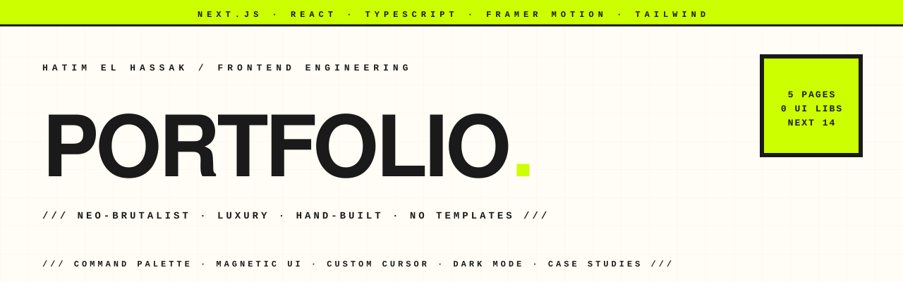

<p align="center">
  <picture>
    <source media="(prefers-color-scheme: dark)" srcset="assets-readme/hero-banner-dark.svg" />
    
  </picture>
</p>

<p align="center">
  
  
  
  
  
  
</p>

<p align="center">
  <em>A Luxury Neo-Brutalist personal portfolio for Hatim El Hassak, built from scratch on Next.js 14 with no templates and no third-party UI libraries. Five hand-built pages — home, work, stack, services, contact — wired with a custom design system, a ⌘K command palette, magnetic interactions, a custom cursor, and full dark/light theming. Deployed on Vercel at <a href="https://hatimelhassak.is-a.dev">hatimelhassak.is-a.dev</a>.</em>
</p>

---

### `/// WHAT IT IS`

A production frontend portfolio that treats the site itself as the work sample. Rather than dropping content into a template, every interactive piece — the command palette, the magnetic buttons, the 3D bento grid, the custom cursor, the theme system — is engineered by hand so the codebase reads as evidence of the craft it advertises. The aesthetic is deliberately "Luxury Neo-Brutalist": high-contrast acid palette, raw borders and grid, layered with glassmorphism and premium typography (Space Grotesk + JetBrains Mono via `next/font`).

---

### `/// HIGHLIGHTS`

| | |
|---|---|
| **⌘K Command Palette** | Keyboard-driven navigation in `CommandPalette.tsx` — opens on `⌘/Ctrl+K`, arrow-key list traversal, `Escape` to close, plus resume download. |
| **Custom design system** | Neo-brutalist tokens (acid lime, raw borders, grid, film grain, glassmorphism) defined in `globals.css` and `tailwind.config.ts` — zero UI libraries. |
| **Magnetic buttons** | `MagneticButton.tsx` uses Framer Motion spring physics so interactive elements pull toward the cursor on hover. |
| **Custom cursor** | `CustomCursor.tsx` swaps the native pointer (`md:cursor-none`) for a hardware-accelerated cursor that reacts to interactive targets. |
| **Dark / light theming** | `ThemeProvider.tsx` + an inline `theme-script.ts` apply the saved preference before paint to avoid flash; `ThemeToggle.tsx` flips it at runtime. |
| **Dynamic case studies** | `app/work/[slug]/page.tsx` renders per-project case studies from `lib/projects.ts` via `generateStaticParams`, with problem / solution / outcomes narratives. |
| **Division architecture** | 30 projects organised into four purpose divisions (Apps / AI & Systems / Client Web / Tools & Play) in `lib/projects.ts` — all site stats derived from the data, never hardcoded. |
| **Contact form** | `ContactForm.tsx` collects name, email, budget, and brief, posting through the `/api/contact` route to Formspree. |
| **Konami easter egg** | A hidden `lord_decay` mode wired into `app/page.tsx` and the custom 404, triggered by the classic cheat code. |
| **SEO + social** | App Router `sitemap.ts`, `robots.ts`, and a dynamic `opengraph-image.tsx` generated at the edge. |

---

### `/// PROJECT STRUCTURE`

```
app/
├── page.tsx               # Home — hero, stats, 3D bento, about, services, CTA
├── work/page.tsx          # Division-indexed project showcase
├── work/[slug]/           # Dynamic case study pages (generateStaticParams)
├── stack/page.tsx         # Skills & proficiency dashboard
├── services/              # Service packages + agency-vs-me comparison
├── contact/page.tsx       # Multi-step contact form + FAQ
├── api/contact/route.ts   # Formspree integration endpoint
├── opengraph-image.tsx    # Dynamic OG image
├── sitemap.ts / robots.ts # SEO surface
├── layout.tsx             # Root layout — nav, cursor, command palette
└── globals.css            # Design system & custom animations
components/
├── ui/                    # CommandPalette, CustomCursor, MagneticButton,
│                          #   BentoGrid, ThemeProvider, ScrollProgress, …
├── home/                  # Hero, Stats, Projects, Services, Philosophy, CTA
├── stack/                 # Stack dashboard content
└── contact/               # Multi-step ContactForm
lib/
├── projects.ts            # Project data & case study content
├── theme-script.ts        # Pre-paint theme application
└── utils.ts               # Shared helpers
```

---

### `/// LOCAL DEV`

```bash
git clone https://github.com/hatimhtm/luxury-engineering-portfolio.git
cd luxury-engineering-portfolio

npm install
npm run dev          # http://localhost:3000

npm run build        # production build
npm start            # serve the build
```

Optional: set `FORMSPREE_ID` in the environment to route the contact form to your own Formspree endpoint.

---

### `/// TECH`

`Next.js 14 (App Router)` · `React 18` · `TypeScript` · `Tailwind CSS 3` · `Framer Motion` · `Lucide React` · `Space Grotesk + JetBrains Mono` · `Formspree` · `Vercel`

---

### `/// STATUS`

Live and personally maintained at [hatimelhassak.is-a.dev](https://hatimelhassak.is-a.dev). No `LICENSE` file is present — this is a personal portfolio, shared publicly for reference; all rights reserved by the author.

---

<p align="center">
  <a href="https://hatimelhassak.is-a.dev"></a>
  <a href="https://cal.com/hatimelhassak/engineering-discovery"></a>
  <a href="https://www.linkedin.com/in/hatim-elhassak/"></a>
  <a href="mailto:hatimelhassak.official@gmail.com"></a>
</p>

<p align="center">
  <code>///&nbsp;&nbsp;OPEN FOR NEW WORK&nbsp;&nbsp;///&nbsp;&nbsp;CONTRACT &amp; FREELANCE&nbsp;&nbsp;///&nbsp;&nbsp;REMOTE WORLDWIDE&nbsp;&nbsp;///</code>
</p>
